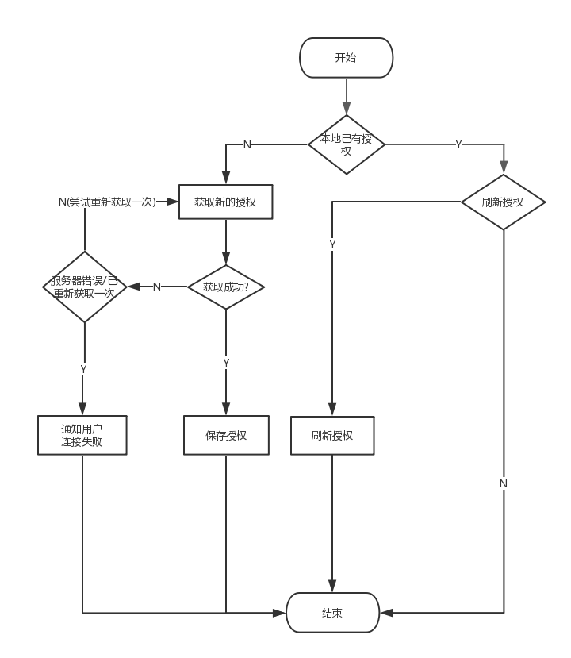

# 获取IM聊天服务器用户账号信息

##接口地址

`/api/v1/im/users`

##请求方法

`GET `

### HTTP Status Code

200

## 返回体

```json5
{
  "status": true,
  "code": 0,
  "message": "操作成功",
  "data": {
    "user_id": 9,
    "im_password": "JAyRaCMTzLmcpAaCFrhfsQkAAAA"
  }
}
```

## 返回字段

| name     | type     | must     | description |
|----------|:--------:|:--------:|:--------:|
| user_id  | int      | yes      | IM聊天用户ID,同用户id |
|im_password|string	  | yes		 |由IM服务器生成的登入token|

## 流程图



code请参见[消息对照表](消息对照表.md)
